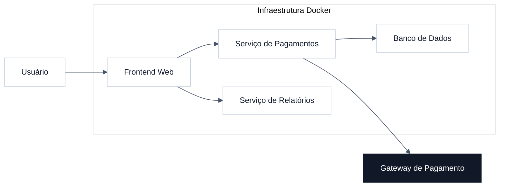
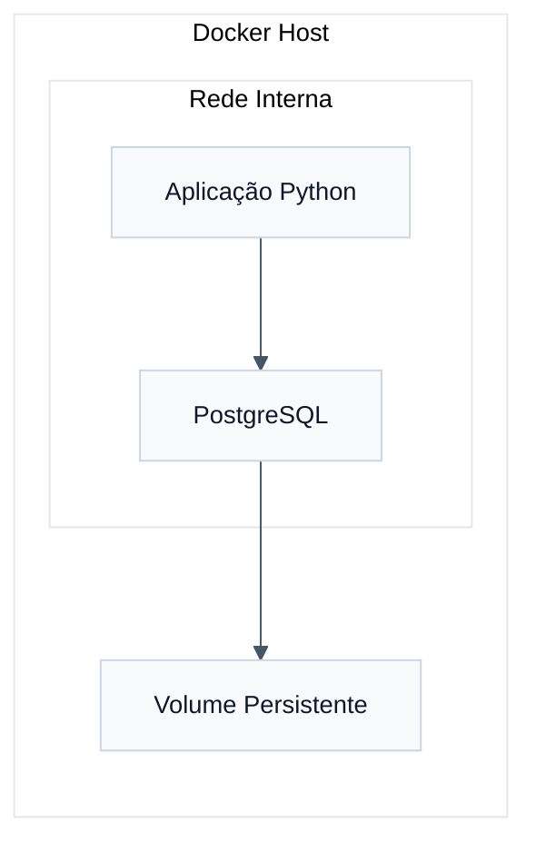
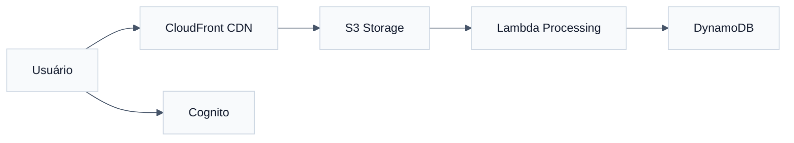
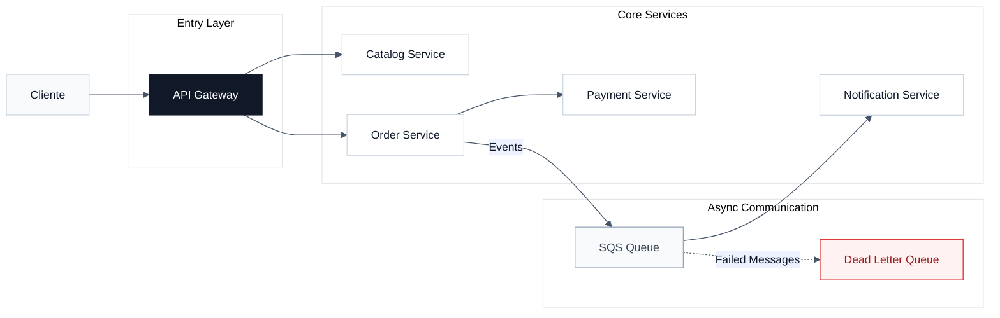

# QUESTÃO 01 | Docker & Aplicação Monolítica

## Objetivo

Padronizar o ambiente da aplicação para garantir deploy consistente entre desenvolvimento e produção.

---

## Dockerfile — Serviço de Pagamentos

```dockerfile
FROM node:18-alpine

WORKDIR /app

COPY package*.json ./
RUN npm install --only=production

COPY . .

EXPOSE 3000

CMD ["node", "server.js"]
```

---

## Arquitetura da Aplicação



---

## Principais Pontos

* Docker garante ambientes consistentes.
* Deploy mais rápido e previsível.
* Dados persistentes devem utilizar volumes.
* Credenciais não devem ficar na imagem.

---

# QUESTÃO 02 | Persistência Local

## Objetivo

Conectar a aplicação Python ao PostgreSQL com persistência segura dos dados.

---

## Comandos Docker

```bash
docker network create rede_dados

docker volume create pg_persist

docker run -d \
  --name db \
  --network rede_dados \
  -v pg_persist:/var/lib/postgresql/data \
  postgres

docker run -d \
  --name app_python \
  --network rede_dados \
  minha_analise_python
```

---

## Estrutura da Solução



---

## Benefícios

* Comunicação simples entre containers.
* Persistência segura dos dados.
* Estrutura desacoplada e reutilizável.

---

# QUESTÃO 03 | Arquitetura Cloud AWS

## Objetivo

Distribuir vídeos globalmente com alta disponibilidade e baixa latência.

---

## Arquitetura Proposta



---

## Benefícios da Solução

| Serviço    | Benefício                 |
| ---------- | ------------------------- |
| S3         | Armazenamento escalável   |
| CloudFront | Baixa latência global     |
| Lambda     | Escalabilidade automática |
| Cognito    | Gestão segura de usuários |

---

# QUESTÃO 04 | Parecer Técnico — Saúde

## Recomendação

Adotar **PaaS (Platform as a Service)**.

---

## Justificativa

### Redução Operacional

Menor esforço com manutenção de infraestrutura.

### Segurança

Responsabilidade compartilhada:

* Provedor → infraestrutura;
* Empresa → acessos e dados.

### Alta Disponibilidade

Uso de múltiplas zonas redundantes.

### Estratégia Recomendada

Modelo híbrido:

* dados sensíveis localmente;
* aplicações e processamento na nuvem.

---

# QUESTÃO 05 | Microsserviços & Mensageria

## Objetivo

Separar responsabilidades para melhorar escalabilidade e resiliência.

---

## Arquitetura de Microsserviços



---

## Benefícios

### Escalabilidade

Cada serviço pode crescer independentemente.

### Resiliência

Falhas em notificações não afetam pedidos.

### Baixo Acoplamento

Serviços mais independentes e fáceis de evoluir.

### Continuidade

Mensagens críticas permanecem armazenadas até reprocessamento.

---

# Conclusão

A solução proposta entrega:

* padronização com Docker;
* escalabilidade em cloud;
* arquitetura resiliente;
* foco em disponibilidade e segurança.

Resultado:
uma plataforma preparada para crescimento sustentável e manutenção simplificada.
