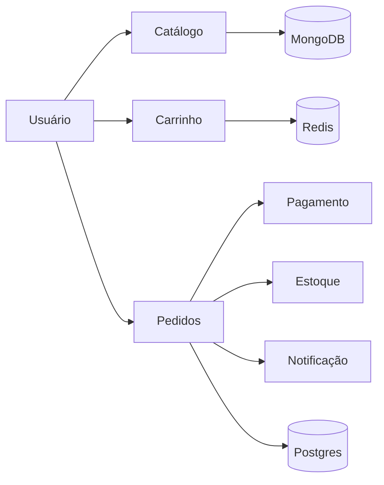
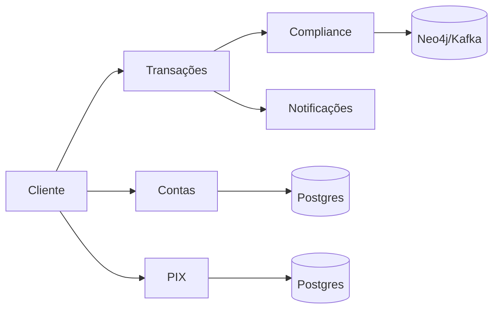
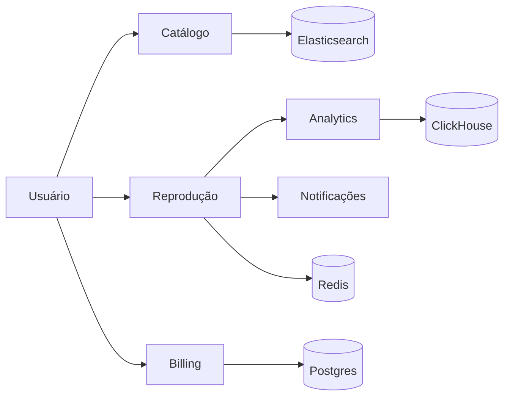

## 1. Diagramas de Arquitetura (Mermaid)

### Tema 1: E-commerce

### Tema 2: Banco Digital

### Tema 3: Streaming

---

## 2. Respostas dos Domínios

| Domínio | 1. Microsserviços e Fronteiras | 2. Comunicação (REST vs Eventos) | 3. Banco de Dados por Serviço | 4. Consistência (Forte vs Eventual) | 5. Escalabilidade em Pico |
| --- | --- | --- | --- | --- | --- |
| **Tema 1: E-commerce** | Catálogo, Carrinho, Pedidos, Pagamento, Estoque, Notificação, Usuário. Fronteiras isoladas por domínio. | Síncrono (REST) para login/carrinho. Assíncrono (Eventos) após fechar pedido para não travar app. | Catálogo (MongoDB), Carrinho (Redis), Pedidos, Estoque e Usuário (PostgreSQL). | Forte no Estoque e Pagamento. Eventual no Catálogo e no envio de Notificações. | Catálogo, Carrinho e Estoque escalam muito na Black Friday por acessos simultâneos. |
| **Tema 2: Banco Digital** | Contas, Transações, PIX, Cartão, Crédito, Notificações, Compliance. Fronteiras bem definidas. | Síncrono (gRPC/REST) para débito e PIX. Assíncrono para Compliance e Notificações. | Contas, PIX e Cartão usam PostgreSQL. Compliance usa Neo4j ou tópicos Kafka. | Forte em Contas, PIX e Transações. Eventual em Notificações e extrato visual. | PIX, Cartão e Antifraude escalam muito no quinto dia útil e horários de almoço. |
| **Tema 3: Streaming** | Catálogo, Reprodução, Usuário, Recomendação, Billing, Analytics, CDN. Fronteiras por contexto. | Síncrono (REST) no login e busca. Assíncrono (Kafka) nos dados de telemetria e recomendações. | Catálogo (Elasticsearch), Reprodução (Redis), Billing (Postgres), Analytics (ClickHouse). | Forte no Billing e Telas Simultâneas. Eventual nas Recomendações e novos itens. | Serviço de Reprodução e a infraestrutura de CDN escalam em lançamentos de séries. |
